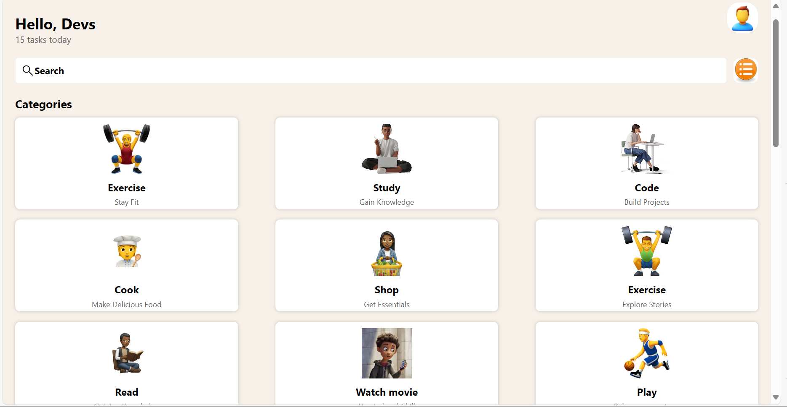

# rn-assignment3-11093177
Student-ID: 11093177

INTRODUCTION:
  This app is a simple and intuitive app designed to help you organize and manage your daily tasks efficiently. The app features a clean UI that allows users to view tasks categorized by activity type, add new tasks, and keep track of ongoing tasks.

  COMPONENTS:

Task Manager App
Task Manager App is a simple and intuitive app designed to help you organize and manage your daily tasks efficiently. The app features a clean UI that allows users to view tasks categorized by activity type, add new tasks, and keep track of ongoing tasks.

Components
1. TaskItem
Displays an individual task with an associated image.
Displays a list of tasks using a FlatList.

2. Displays a list of tasks using a FlatList.

3. Category
Displays a category card with an icon, title, and subtitle.

Main App Component
The main component that utilizes the above components to render the task manager app.

SCREENSHOTS:

